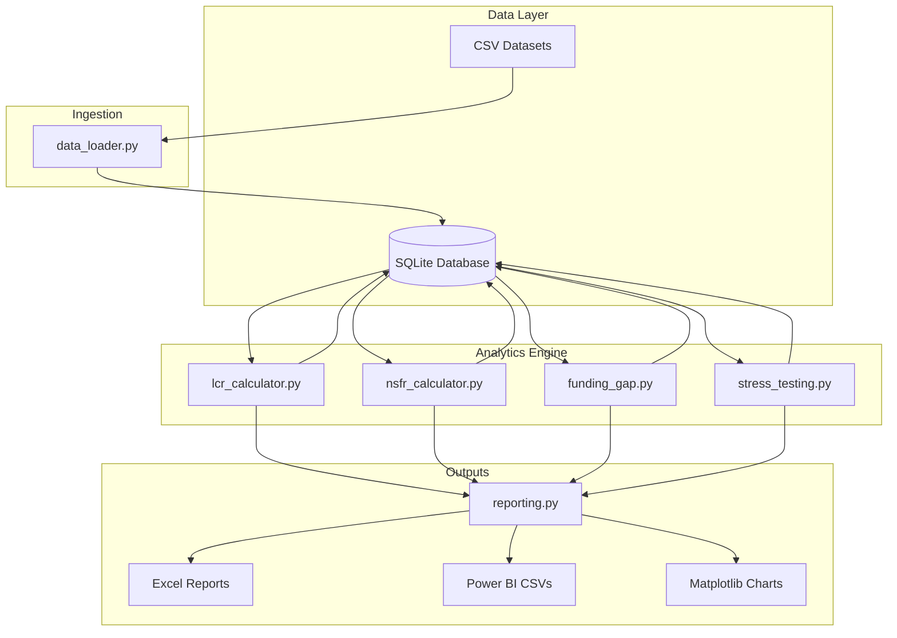

# Treasury Liquidity & Funding Analytics Dashboard

A production-style **Treasury Risk Analytics** platform simulating how global bank treasury teams monitor liquidity, funding risk, regulatory ratios, and management reporting.

Built for portfolio demonstration in **Quant Finance**, **Treasury Analytics**, **Liquidity & Funding Risk**, and **Regulatory Reporting** roles.

---

## Overview

This platform ingests balance sheet and funding data, calculates Basel III-style **LCR** and **NSFR**, performs **liquidity stress testing**, identifies **funding gaps**, and generates **treasury management reports** with **Power BI** integration.

| Capability | Description |
|---|---|
| LCR Engine | Daily Liquidity Coverage Ratio with regulatory breach alerts |
| NSFR Engine | Net Stable Funding Ratio with trend analysis |
| Funding Gap | Maturity bucket analysis (0–30d through 1+ years) |
| Stress Testing | Market, deposit run, rate shock, and combined scenarios |
| Reporting | Excel management reports + Power BI dataset exports |
| Database | SQLite persistence for all source and computed data |

---

## Architecture



### Data Flow

```
balance_sheet.csv ──┐
liquidity_assets.csv├──► data_loader ──► SQLite ──► Analytics Modules ──► Reports / Power BI
funding_sources.csv ├──►
cashflows.csv ──────┘
```

---

## Project Structure

```
Treasury_Analytics/
├── data/                          # Source CSV datasets
│   ├── balance_sheet.csv
│   ├── funding_sources.csv
│   ├── liquidity_assets.csv
│   └── cashflows.csv
├── database/
│   └── treasury.db                # SQLite database (generated)
├── reports/
│   ├── liquidity_report.xlsx
│   ├── stress_test_report.xlsx
│   ├── funding_gap_report.xlsx
│   └── charts/                    # LCR/NSFR trend PNGs
├── powerbi/
│   ├── *.csv                      # Power BI import datasets
│   └── POWERBI_SETUP.md           # Dashboard build guide
├── src/
│   ├── data_loader.py
│   ├── database.py
│   ├── lcr_calculator.py
│   ├── nsfr_calculator.py
│   ├── funding_gap.py
│   ├── stress_testing.py
│   ├── reporting.py
│   ├── main.py
│   └── streamlit_app.py           # Optional interactive dashboard
├── scripts/
│   └── generate_sample_data.py
├── main.py
├── requirements.txt
└── README.md
```

---

## Quick Start

### 1. Install Dependencies

```bash
cd Treasury_Analytics
pip install -r requirements.txt
```

Optional Streamlit dashboard:

```bash
pip install streamlit plotly
```

### 2. Generate Sample Data (first run)

```bash
python scripts/generate_sample_data.py
```

### 3. Run the Full Pipeline

```bash
python main.py
```

This executes all 8 steps:

1. Load datasets
2. Populate database
3. Calculate LCR
4. Calculate NSFR
5. Run funding gap analysis
6. Run stress tests
7. Generate Excel reports
8. Export Power BI datasets

### 4. Optional Streamlit Dashboard

```bash
streamlit run src/streamlit_app.py
```

### 5. Power BI Dashboard

Import CSV files from `powerbi/` into Power BI Desktop. Follow `powerbi/POWERBI_SETUP.md` for page layouts, visuals, and DAX measures.

---

## Regulatory Metrics

### Liquidity Coverage Ratio (LCR)

```
LCR = HQLA / Net Cash Outflows × 100
```

| Status | Threshold |
|---|---|
| Green | LCR ≥ 100% |
| Yellow | 90% ≤ LCR < 100% |
| Red | LCR < 90% |

HQLA is adjusted using Basel III haircuts:
- Level 1: 100%
- Level 2A: 85%
- Level 2B: 50%

### Net Stable Funding Ratio (NSFR)

```
NSFR = Available Stable Funding / Required Stable Funding × 100
```

Minimum regulatory threshold: **100%**

ASF factors vary by funding type (retail deposits 90%, wholesale 50%, capital 100%, etc.). RSF is applied to loans (85%), HQLA (5%), and other assets (50%).

---

## Stress Testing Scenarios

| Scenario | Shock |
|---|---|
| Market Stress | −20% HQLA value |
| Deposit Run | −15% customer deposits |
| Interest Rate Shock | +300 bps rate increase |
| Combined Stress | Market Stress + Deposit Run |

Each scenario reports impacted **LCR**, **NSFR**, **Funding Gap**, and **Capital Impact**.

---

## Database Schema

| Table | Purpose |
|---|---|
| `balance_sheet` | Daily balance sheet positions |
| `liquidity_assets` | HQLA inventory by asset type |
| `funding_sources` | Funding liabilities with maturity |
| `cashflows` | Expected inflows/outflows by BU |
| `lcr_results` | Daily LCR calculations |
| `nsfr_results` | Daily NSFR calculations |
| `stress_tests` | Stress scenario results |
| `funding_gap_results` | Maturity bucket funding gaps |

---

## Sample Output

After running `python main.py`:

```
============================================================
  TREASURY LIQUIDITY & FUNDING ANALYTICS — RUN COMPLETE
============================================================
  Report Date:           2025-12-31
  Total Assets:          $85,000,000,000
  Average LCR:           125.43%
  Average NSFR:          112.67%
  Liquidity Buffer:      $2,450,000,000
  LCR Breaches:          0 days
============================================================
```

---

## Skills Demonstrated

- **Treasury Analytics** — Daily liquidity and funding monitoring
- **Liquidity Risk Management** — LCR/NSFR regulatory ratio engines
- **Funding Risk Analysis** — Maturity gaps and concentration risk
- **Financial Modelling** — Basel III-inspired calculation frameworks
- **Stress Testing** — Multi-scenario treasury stress analysis
- **Python** — pandas, numpy, scipy, SQLAlchemy, matplotlib
- **SQL** — Relational schema design and persistence
- **Power BI** — Dataset preparation and dashboard design
- **Regulatory Reporting** — Breach alerts and management reports
- **Banking Analytics** — Balance sheet, HQLA, and funding data models

---

## Resume Bullet Points

> Developed a Treasury Liquidity & Funding Analytics platform calculating Basel III LCR/NSFR ratios, performing multi-scenario stress tests, and generating regulatory breach alerts across 365 days of balance sheet data.

> Built automated funding gap analysis across five maturity buckets, identifying concentration risk in wholesale funding sources and exporting executive dashboards to Power BI.

> Designed a modular Python/SQL analytics pipeline processing $85B balance sheet data with Excel management reporting for treasury risk committees.

---

## License

MIT — Portfolio and educational use.
