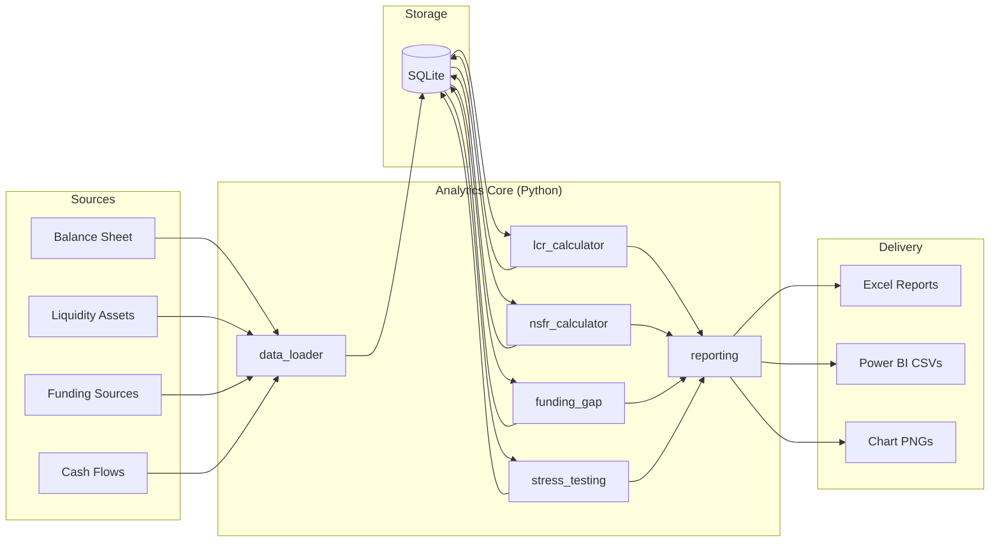
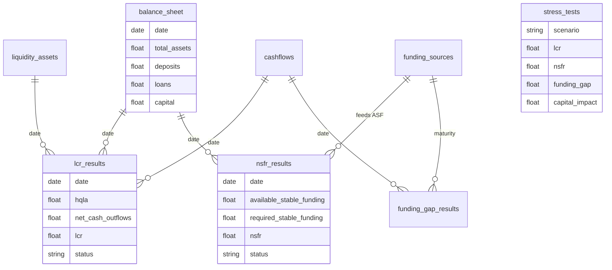

# Treasury Analytics — Technical Architecture

## System Context

The platform simulates a bank treasury department's daily liquidity and funding risk monitoring workflow. Source data flows from CSV files into a SQLite database, through regulatory calculation engines, and into Excel reports and Power BI datasets.

## Component Diagram

## Module Responsibilities

| Module | Responsibility |
|---|---|
| `database.py` | SQLAlchemy schema, engine, table definitions |
| `data_loader.py` | CSV ingestion, DB population, table reads |
| `lcr_calculator.py` | HQLA haircuts, net cash outflows, daily LCR |
| `nsfr_calculator.py` | ASF/RSF factors, daily NSFR |
| `funding_gap.py` | Maturity buckets, gap analysis, concentration |
| `stress_testing.py` | Four regulatory stress scenarios |
| `reporting.py` | Excel workbooks, Power BI exports |
| `main.py` | End-to-end orchestration |

## Regulatory Calculation Logic

### LCR

1. Apply HQLA haircuts by asset category (Level 1/2A/2B)
2. Estimate 30-day net cash outflows from contractual flows + deposit runoff
3. Cap inflows at 65% of outflows (Basel simplified)
4. `LCR = HQLA / Net Cash Outflows × 100`

### NSFR

1. Compute Available Stable Funding using funding-type ASF factors and maturity adjustments
2. Compute Required Stable Funding on loans, HQLA, and other assets
3. `NSFR = ASF / RSF × 100`

### Stress Testing

Scenarios apply shocks to HQLA values, deposit balances, and interest rates, then re-run LCR, NSFR, and funding gap calculations.

## Database ERD

## Deployment

Single-command execution via `python main.py`. No external services required (SQLite embedded). Power BI Desktop imports CSV exports from `powerbi/`.

Optional Streamlit dashboard (`streamlit run src/streamlit_app.py`) provides interactive exploration without Power BI.
